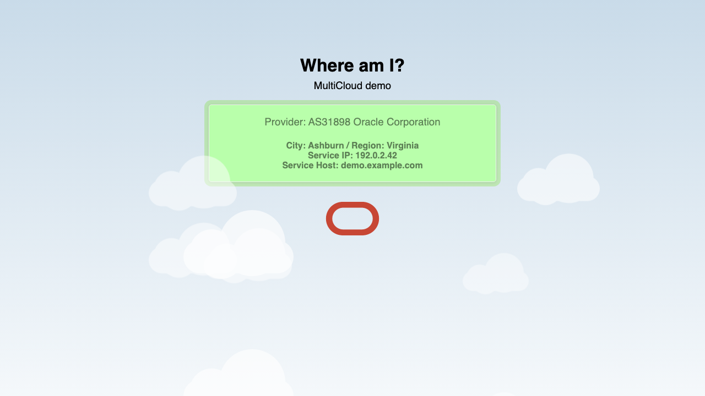

# Where am I? — MultiCloud demo

A small React app that, on startup, looks up the **server's own** IP details and shows which
cloud or network it is running in — with the matching provider logo over an animated cloud
backdrop. Deploy the same image to AWS, Azure, OCI, a Raspberry Pi, or your laptop and it
tells you where it landed.




## How it works

At container start, [`entrypoint.sh`](entrypoint.sh) fetches the server's public IP details
from [ipinfo.io](https://ipinfo.io) into a static `ipinfo.json`. The React app reads that file
and maps the network's AS number to a provider logo (Oracle, AWS, Azure, Akamai, Cloudflare,
…). If the lookup fails (offline, rate-limited), a bundled placeholder is served so the app
still starts instead of crash-looping.

## Quickstart (Docker)

```bash
docker run --rm -it -p 8000:8080 ghcr.io/junior/whereami
# → open http://localhost:8000
```

With your own ipinfo.io token (higher rate limits):

```bash
docker run --rm -it -p 8000:8080 -e IPINFO_TOKEN=your_token ghcr.io/junior/whereami
```

## Development

```bash
npm install
npm run dev        # Vite dev server → http://localhost:3000
```

`npm run build` emits static files to `dist/`; `npm run lint` runs ESLint. In dev the app
serves the bundled `public/ipinfo.json` sample, so the card is populated without a token.

## Kubernetes

Quick run:

```bash
kubectl run whereami --image=ghcr.io/junior/whereami --port=8080
kubectl port-forward pod/whereami 8000:8080      # → http://localhost:8000
```

Persistent — the manifests in [`k8s/`](k8s/) run as a non-root user, drop all Linux
capabilities, and add readiness/liveness probes:

```bash
kubectl apply -f https://raw.githubusercontent.com/junior/whereami/main/k8s/deployment.yaml
kubectl apply -f https://raw.githubusercontent.com/junior/whereami/main/k8s/service.yaml
kubectl apply -f https://raw.githubusercontent.com/junior/whereami/main/k8s/ingress.yaml
```

To pass an ipinfo.io token, create a Secret (the Deployment reads it, `optional: true`):

```bash
kubectl create secret generic whereami --from-literal=ipinfo-token=your_token
```

## Configuration

| Variable | Default | Purpose |
|----------|---------|---------|
| `IPINFO_TOKEN` | _(empty)_ | ipinfo.io API token to raise the request rate limit. Unauthenticated works for light use. |

The container listens on **8080** as a non-root user. The token is used server-side at
startup only — it is never sent to the browser.

## Build the image

```bash
# single platform
docker build -t whereami .
docker run --rm -it -p 8000:8080 whereami

# multi-platform → registry
docker buildx build --push --platform linux/amd64,linux/arm64 \
  -t your-registry/whereami:latest .
```

## Tech

React 19 · Vite 6 · non-root nginx · Docker · Kubernetes

## License

[MIT](LICENSE).
